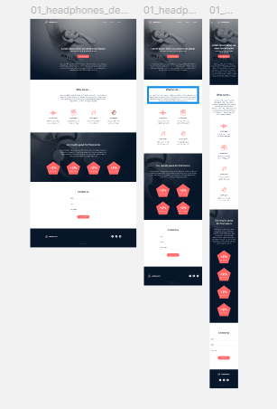

# ALU Headephones.
In this project, I am to build a webpage from scratch using HTML, CSS, Accessibility, and Responsive design knowledge learned previously.

At the end of the project, the website should be responsive such that it can be viewed in multiple devices and screens, in this case, it should be viewable in desktop, tablet and mobile.
The screenshot provided below is the website should look at the end of the project.

